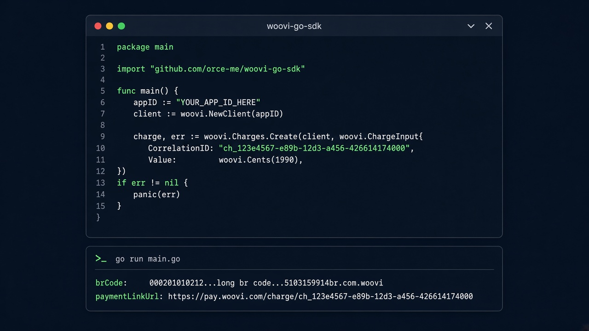

<p align="center">
  
</p>

<h1 align="center">woovi-go-sdk</h1>

<p align="center">
  <strong>Go SDK for the Woovi (OpenPix) REST API</strong>
</p>

<p align="center">
  Typed clients · <code>context.Context</code> · money in cents · zero dependencies
</p>

<p align="center">
  <a href="https://orce-me.github.io/woovi-go-sdk/"></a>
  <a href="https://pkg.go.dev/github.com/orce-me/woovi-go-sdk"></a>
  <a href="https://github.com/orce-me/woovi-go-sdk/actions/workflows/ci.yml"></a>
  <a href="LICENSE"></a>
</p>

<p align="center">
  <a href="https://orce-me.github.io/woovi-go-sdk/"><b>Documentation →</b></a>
  ·
  <a href="https://developers.woovi.com/">Woovi API</a>
  ·
  <a href="https://pkg.go.dev/github.com/orce-me/woovi-go-sdk">GoDoc</a>
</p>

<p align="center">
  
</p>

## Install

```bash
go get github.com/orce-me/woovi-go-sdk
```

Requires Go 1.23+.

## Quick start

```go
package main

import (
	"context"
	"log"
	"os"

	"github.com/orce-me/woovi-go-sdk"
)

func main() {
	client, err := woovi.NewClient(os.Getenv("WOOVI_APP_ID"))
	if err != nil {
		log.Fatal(err)
	}

	result, err := client.Charges.Create(context.Background(), &woovi.ChargeCreateParams{
		CorrelationID: "pedido-4321",
		Value:         woovi.Cents(1990), // R$ 19,90
		Comment:       woovi.String("Pedido #4321"),
	})
	if err != nil {
		log.Fatal(err)
	}

	log.Println(result.Charge.BrCode)
	log.Println(result.Charge.PaymentLinkURL)
}
```

Send the AppID in `Authorization` with **no** `Bearer` prefix. Keep it on the server.

## Features

- Functional options (`WithBaseURL`, `WithHTTPClient`, `WithRetry`, …)
- Typed `APIError` with `errors.As` / `errors.Is`
- Pagination: `List`, `ListAll`, `ListPages` (`iter.Seq2`)
- Retry with full jitter for safe methods
- Hooks: `WithOnRequest`, `WithOnResponse`
- Webhook verify package (`RSA` + `HMAC`)

## Options

```go
client, err := woovi.NewClient(appID,
	woovi.WithBaseURL("https://api.woovi.com"),
	woovi.WithHTTPClient(http.DefaultClient),
	woovi.WithRetry(woovi.RetryConfig{MaxRetries: 2}),
	woovi.WithLogger(slog.Default()),
	woovi.WithOnResponse(func(req woovi.RequestInfo, resp woovi.ResponseInfo) {
		log.Println(req.Method, resp.StatusCode, resp.Duration)
	}),
)
```

## Examples

```bash
export WOOVI_APP_ID=your-app-id
go run ./examples/create_charge
go run ./examples/webhook_server
```

More guides: **[orce-me.github.io/woovi-go-sdk](https://orce-me.github.io/woovi-go-sdk/)**

## License

MIT
